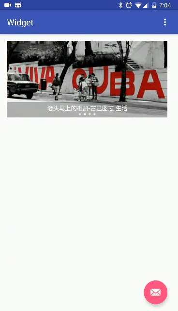

# Android Banner Best Practice

# feature

  - custom image loaddder
  - banner title
  - clickable
  - single class


# how to

1. in layout

```xml
 <com.leenanxi.open.wdget.BannerView
            android:id="@+id/banner"
            android:layout_width="match_parent"
            android:layout_height="180dp"/>

```

2. In Java
```java
             private void initViews(View parentView) {

             BannerView bannerView = (BannerView) parentView.findViewById(R.id.banner);
             bannerView.setTitleEnabled(true);
             bannerView.setBannerItems(bannerItems);
             bannerView.startLoop();
             bannerView.setOnItemClickListener(new BannerView.OnItemClickListener() {
                 @Override
                 public void onClick(int position) {
                     Toast.makeText(getContext(),"You click " + String.valueOf(position),Toast.LENGTH_SHORT).show();
                 }
             });
             /**
              * Custom Your Image Loader
              */
             bannerView.setImageLoadder(new BannerView.ImageLoader(){
                 @Override
                 public void loadImage(ImageView imageView, String url) {
                     Glide.with(imageView.getContext())
                             .load(url)
                             .placeholder(R.drawable.image_place_holder)
                             .dontAnimate()
                             .dontTransform()
                             .into(imageView);
                 }
             });
         }

         @Override
         public void onDestroyView() {
             mBannerView.stopLoop();
             super.onDestroyView();

         }
```

# screenshots




